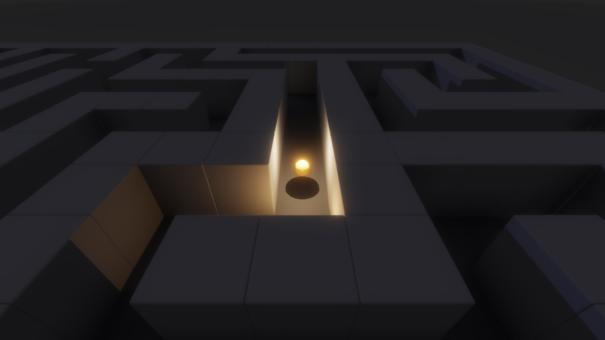
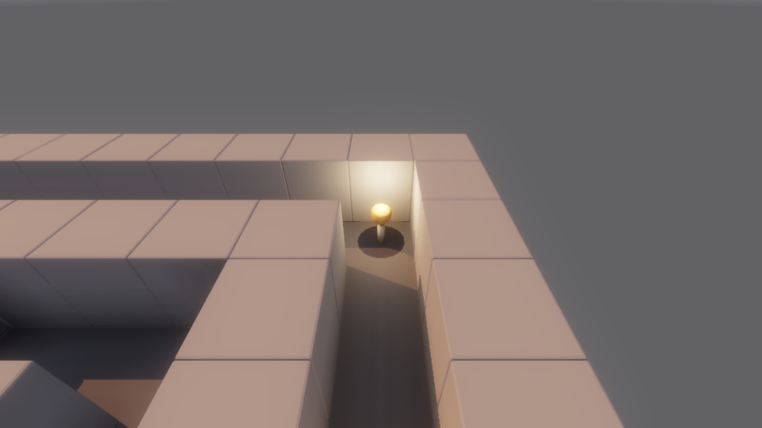

# Lightkeeper

The first game built on Candela — and a working demonstration that the engine
API is enough to ship gameplay: ECS, model assets, point lights, emissive
materials, input actions, and the renderer, driven from one `main.cpp`.

You are a wisp of flame in a night-shrouded shrine. Seven candles have gone
out. Drift through the maze and touch each one to relight it — when the last
candle burns, dawn breaks over the shrine in real time.

## Controls

| Input | Action |
|---|---|
| WASD | Move (camera-relative) |
| Hold right mouse | Orbit the follow camera |
| Escape | Quit |

Progress and the run timer live in the window title; everything else is told
through light.

## Flags

| Flag | Effect |
|---|---|
| `--autoplay` | Attract mode: the wisp pathfinds to every candle and wins unattended |
| `--frames N` | Exit after N frames (headless smoke runs) |
| `--screenshot <path>` | Capture the backbuffer near the frame limit (or mid-dawn on an autoplay win) |

`--autoplay --frames 1600` doubles as an end-to-end gameplay test: it proves
ignition, the win state, and the dawn ramp with no human input — it runs on a
GPU-less machine under Xvfb + lavapipe.

## How it's built

- **The maze** is an ASCII grid in `src/Level.h` — pure logic (collision,
  flood fill, BFS pathfinding), no engine or GPU dependencies.
  `lightkeeper-leveltest` proves every candle is reachable from the start and
  that circle-vs-grid collision never tunnels or sticks, including the
  degenerate exactly-on-a-corner cases.
- **Candles** are one `.glb` with two meshes; ignition swaps the entity's
  `MeshRenderer` from `CandleUnlit` to `CandleLit` (adds the flame) and fades
  in a flickering point light.
- **Lights ride child entities** lifted above their emitting mesh — a light
  at the centre of its own geometry is fully self-shadowed under ray-traced
  shadows.
- **Dawn** is a smoothstep ramp of the scene settings (sun direction,
  intensity, colour, IBL, exposure, bloom) from moonlight to morning.
- **Assets** (`content/*.glb`) were authored headlessly in Blender's Python
  API and committed — no external downloads needed.
