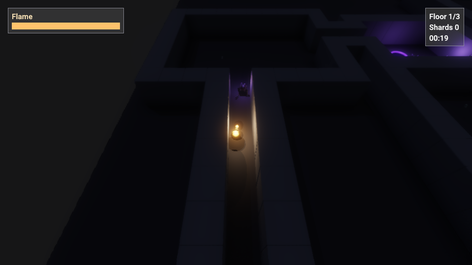
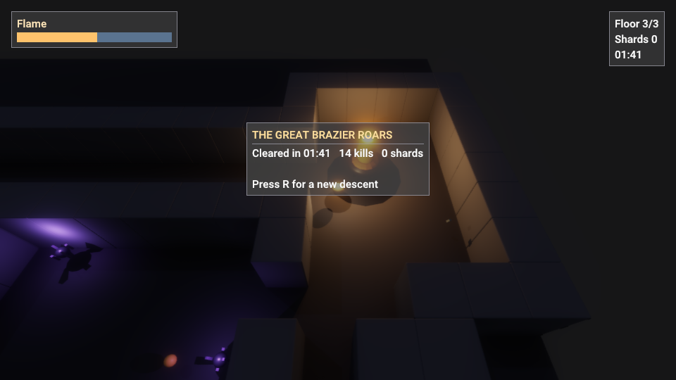

# Emberwake

The second game built on Candela, and a deliberate step up from
[Lightkeeper](../lightkeeper/README.md): procedural generation, real-time
combat, enemy AI, projectiles, pickups, a boss fight, and an in-game
ImGui HUD — all driven through the public engine API from one `main.cpp`.

You are a wisp of flame descending a dark dungeon. Your flame is your
life — take hits and your light visibly gutters. Fight down three seeded
floors, break **The Smother**, and relight the Great Brazier.

## Controls

| Input | Action |
|---|---|
| WASD | Move (camera-relative) |
| Left mouse | Fire ember bolts at the cursor |
| Hold right mouse | Orbit the follow camera |
| R | Restart after death or victory |
| Escape | Quit |

## Flags

| Flag | Effect |
|---|---|
| `--seed N` | Dungeon seed (default 7) — same seed, same descent |
| `--autoplay` | Bot mode: fights its way down and wins unattended |
| `--size WxH`, `--frames N`, `--screenshot <path>` | Headless runs (screenshot fires at the moment of victory in bot runs) |

## How it's built

- **Dungeons** are seeded rooms-and-corridors generation in `src/Dungeon.h`
  (pure logic, on the shared `gamegrid::GridMap` base from
  `game/common/Grid.h`). `emberwake-dungeontest` proves the invariants across
  400 seeds: full connectivity, solid borders, valid spawn/stairs placement,
  determinism, and scatter rules for enemies and pickups.
- **Enemies** hover (no skinned animation needed): *Shades* chase — straight
  steering with line-of-sight, BFS repathing without; *Hollows* keep their
  distance and spit dark bolts; *The Smother* is a slow juggernaut with a
  radial ring burst that summons shade adds at ⅔ and ⅓ health.
- **Combat** is projectile-based both ways. Player bolts are emissive meshes
  carrying a lifted point light — every shot sweeps real ray-traced shadows
  down the corridor. Bolts substep their motion so they can't tunnel wall
  corners.
- **Diegetic health**: the wisp's light intensity and radius scale with
  remaining flame; hits also grant brief i-frames and knockback.
- **HUD and menus** are ImGui rendered through the engine's game-UI pass
  (`RenderOptions.recordUI` with the scene on the backbuffer): flame bar,
  floor/shards/timer, a boss bar, fading centre-screen callouts, and
  title/death/victory screens.
- **The bot** (`--autoplay`) is the headless end-to-end test: it kites
  chasers, strafes at range, leads its shots, fetches embers when hurt,
  pathfinds to each rift, hunts the boss, and lights the brazier — proving
  combat, damage in both directions, floor transitions, boss phases, and the
  win state with no human input.
- **Assets** (`content/*.glb`) were authored headlessly in Blender's Python
  API: crystal-cluster enemies with emissive cores, twin-mesh brazier
  (unlit/lit swap), bolts, pickups, dungeon tiles.
